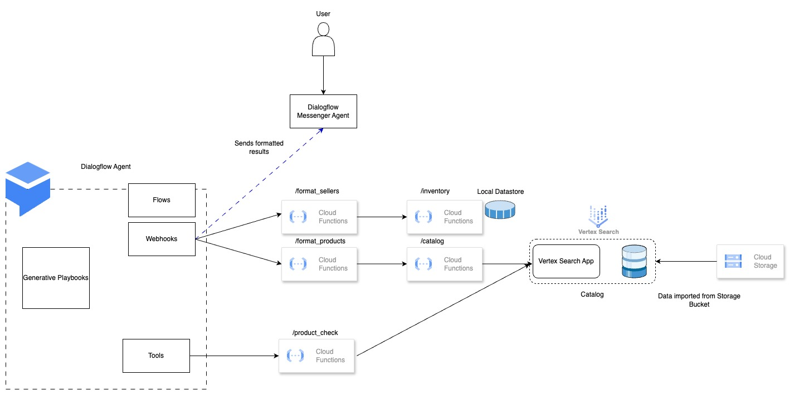
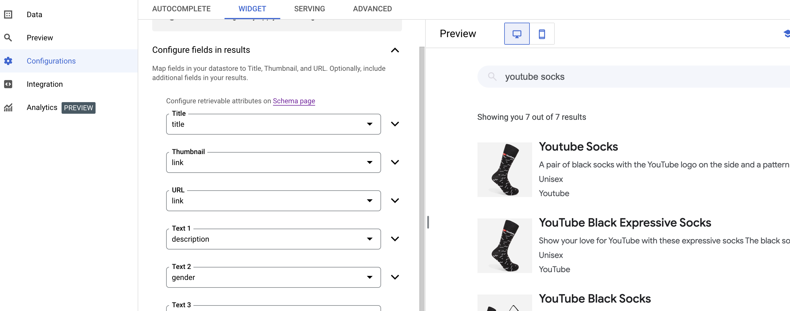

## Introduction

__VERSION__: 0.1-alpha

We'll be creating a generative chatbot for a fictitious Google Merch Store Marketplace. The chatbot acts like a shopping assistant who helps users find the items they are looking for. Because it is a marketplace, the items are sold by independant sellers. Each seller has a rating. And the seller can seller an item for a certain price and the item may be *new*, *good as new* or *used*. The chatbot can also help the user select a seller based on the seller's rating, item price or item condition.


[](https://youtu.be/VuJs4eF235U)


**NOTE**: 
1. This is a demo, and can not handle all potential responses the user makes. There may be some bugs you encounter. If the chatbot gets confused, restart the chatbot (or start a new session) and continue. 
1. This repo is a WIP. There may be bugs in the Readme steps, we will test this out in the next few weeks and update. Please file an Issue if you find a bug.


### The dataset
The product catalog is a modified and augemented version of the Google Merch Store catalog. The sellers, their ratings, the item prices and conditions are generated artificially in this repo. The scripts can be found in the *datamanipulation* folder, and the original merch store dataset can be found here: *datamanipulation/data/input.csv*

### Architecture on Google Cloud
This examples uses the following elements:
1. Dialogflow: Chatbot
2. Generative Playbooks: Extends the chatbot with GenAI features.
3. Vertex Search: Stores the product catalog dataset and performs semantic search on its items.
4. Cloud Storage: Stores the raw catalog files and schema used to create the Vertex Search datastore.
5. Cloud functions: Act a helpers to invoke the necessary search APIs and format results for the user.




## Getting started
We assume that you have python and gcloud CLI tools installed.
**NOTE**: This example uses *Generative Agents* (in Vertex Conversations). This is still in private preview and you'll need to get it allow-listed to be used in your Google Cloud project.
For internal Google users, refer to the *go/generative-playbook-faq* for more information on how to do this.
### Setup
If you have this enabled on your project, let's get started.
1. Clone this repo.
   ```bash
   git clone https://github.com/MKand/shopping_assistant.git
   cd shopping_assistant
   ```
1. Set some environment variables.

    
    ```bash
    export PROJECT_ID=<project_id>
    export SEARCH_DATASTORE_LOCATION=GLOBAL
    export REGION=<location of bucket and other infra>
    ```
1. Set your active project
    ```bash
    gcloud config set project $PROJECT_ID
    
    ```

#### Enable APIs
WIP: 
This is a list of minimal services that need to be enabled on your account for this setup. This list may not be complete, but we will test this out and update this.

```bash
gcloud services enable \
artifactregistry.googleapis.com chat.googleapis.com cloudbuild.googleapis.com \
cloudfunctions.googleapis.com cloudresourcemanager.googleapis.com compute.googleapis.com \
contactcenteraiplatform.googleapis.com containerregistry.googleapis.com \
dataform.googleapis.com dialogflow.googleapis.com discoveryengine.googleapis.com 


gcloud services enable \
logging.googleapis.com notebooks.googleapis.com oslogin.googleapis.com \
run.googleapis.com source.googleapis.com staging-cloudresourcemanager.sandbox.googleapis.com \
storage-api.googleapis.com \
vision.googleapis.com visionai.googleapis.com aiplatform.googleapis.com \
storage-component.googleapis.com
```

This api **test-dialogflow.sandbox.googleapis.com** is also required, but it needs to be done manually as explained in the note earlier in the documentation.

#### Create dataset files

1. Assuming you're going to use the created datasets directly, let's upload them. If you want to follow all the steps for dataset manipulation, go to the Readme in the datamanipulation folder.

    There are two files we use, the *catalog* file (this contains all the products in the merch store) and the *inventory* file which links products to the sellers on the marketplace.
    In this example, the catalog is served by vertex search and the inventory file is stored in a dataframe in a Google Cloud function. We don't use vertex search for the inventory as the queries are very simple and don't require vertex search. 

     ```bash
       gcloud storage buckets create gs://$PROJECT_ID-product_catalog --location=$REGION
      ```
       
    We'll upload the catalog file to the bucket.
      ```bash
      gcloud storage cp datamanipulation/data/catalog_jsonlines.json gs://$PROJECT_ID-product_catalog
      ```
 
 #### Create Vertex Search App and Dataset

 1. Create a search application in Vertex search.
  Follow the steps [here](https://cloud.google.com/generative-ai-app-builder/docs/create-engine-es#genappbuilder_create_app-console). 
 * Select **SEARCH** as the app type.
 * You can use the name *merch-catalog-search* for **AppName** and *merch-online* for **Company Name**. 
 * Turn off *Enterprise features* and *Advanced LLM features*.
 * Set the *GLOBAL* as the **Location**.
 * In the next step, choose **CREATE A NEW DATASTORE**. 
 * Select the bucket we created in the previous step and select **JSON for structured data (Preview)** as the type of data you are importing. 
 * Give the name *merch-catalog* as the **Datastore name**. 
 * This should generate a datastore-id automatically that looks something like this *merch-catalog-123456789*. 
 * Store this value as an environment variable.
     ```bash
    export CATALOG=<datastore_id>
    ```

 At the end of this step, you should have a *Vertex Search App* and a connected *datastore*. 

2. Next, we want to update the default schema to retrieve the *description* field of the dataset as we present this to the user. To do this, we update the schema. We update the *description* field to be *retrievable*. Wait about 5 minutes for before run the following command. This is to ensure that the documents are ingested and the search app discovers the datastore. You can test this out by going to the preview section of the search app and searching for an item like socks. Wait until some results are returned. If the app has found the dataset and returns results, run the following command to enable description retrieval.

```bash
curl -X PATCH \
-H "Authorization: Bearer $(gcloud auth print-access-token)" \
-H "Content-Type: application/json" \
"https://discoveryengine.googleapis.com/v1beta/projects/$PROJECT_ID/locations/global/collections/default_collection/dataStores/$CATALOG/schemas/default_schema" \
-d '{
  "structSchema": { "$schema": "https://json-schema.org/draft/2020-12/schema", "type": "object", "properties": { "description": { "type": "string", "retrievable": true, "keyPropertyMapping": "description" }, "brand": { "indexable": true, "retrievable": true, "searchable": true, "type": "string", "dynamicFacetable": true }, "category": { "indexable": true, "type": "string", "retrievable": true, "searchable": true, "dynamicFacetable": true }, "link": { "retrievable": true, "indexable": true, "type": "string", "searchable": true, "dynamicFacetable": true }, "gender": { "indexable": true, "dynamicFacetable": true, "type": "string", "retrievable": true, "searchable": true }, "color": { "type": "string", "dynamicFacetable": true, "searchable": true, "indexable": true, "retrievable": true }, "title": { "keyPropertyMapping": "title", "retrievable": true, "type": "string" }, "product_id": { "retrievable": true, "type": "string", "dynamicFacetable": true, "searchable": true, "indexable": true }, "id": { "indexable": true, "retrievable": true, "type": "string", "dynamicFacetable": true, "searchable": true } } } 
}'
```

3. You can preview the search app, by navigating to the *Preview* section of the app, and configuring the widget to preview the fields of the dataset that you find interesting. Doing a search for an item should yield  results. It is best to wait a while before you get results with description, product_id, as updating the datastore schema is not an instant process. 

  

Crucially, wait till you see the *description* in the preview results before proceeding to the next steps. It might take 10-15 minutes. If even after that time, no descriptions appear, rerun the aftorementioned command  again.

#### Deploy Cloud functions
 
Next it is time to deploy the CloudFunctions required for the chatbot. In this version, the functions run **unauthenticated**. You will need the Domain Restriction policy in the Organizational policies to be disabled. So follow these [steps](https://cloud.google.com/resource-manager/docs/organization-policy/restricting-domains#console). We'll update the Readme later to show you how to add authentication.
We need to create a service account with the necessary permissions for the functions to access the search app. 

```bash
gcloud iam service-accounts create functions-service-account \
--description="service account for functions" \
--display-name="functions service account" 

gcloud projects add-iam-policy-binding $PROJECT_ID \
--member="serviceAccount:functions-service-account@$PROJECT_ID.iam.gserviceaccount.com" \
--role="roles/discoveryengine.viewer"

export FUNCTIONS_SERVICE_ACCOUNT=functions-service-account@$PROJECT_ID.iam.gserviceaccount.com
```

We have 5 functions to deploy. YSu
* The **catalog** function. This function forwards search queries to the *Vector Search App* and returns the results.
    ```bash
    source deploy_catalog.sh
    ```
    
    Store the URL of the function as CATALOG_URL
    
    ```bash
    export CATALOG_URL="https://$REGION-$PROJECT_ID.cloudfunctions.net/catalog" 
    ```
    You can test this out by running this query.

    ```bash 
     curl $CATALOG_URL?product=socks&brand=youtube
    ```
    This should return a result that looks like this
    ```bash
    [{"brand":"Youtube","color":"['Blue', 'White']","description":"The Agones Retro Pixel Crew Socks are the perfect way to add a touch of style and fun to your everyday wardrobe These socks are made from a soft and comfortable cotton blend and feature a colorful pixelated design Theyre perfect for pairing with your favorite sneakers or boots","gender":"Unisex","link":"https://shop.googlemerchandisestore.com/store/20200306486/assets/items/images/GGOSGAXA110010.jpg","product_id":"GGOSGAXA110010","title":"Agones Retro Pixel Crew Socks"},{"brand":"Youtube","color":"['Black', 'White']","description":"A pair of black socks with the YouTube logo on the side and a pattern of white squiggles all over","gender":"Unisex","link":"https://shop.googlemerchandisestore.com/store/20160512512/assets/items/images/GGOEYAXA197410.jpg","product_id":"GGOEYAXA197410","title":"Youtube Socks"}]
    ```
* The **inventory** function. This function searches for a *product_id* and returns the details of the sellers  selling the item.

    ```bash
    source deploy_inventory.sh
    ```
    Store the URL of the function as INVENTORY_URL
    
    ```bash
    export INVENTORY_URL="https://$REGION-$PROJECT_ID.cloudfunctions.net/inventory"    
    ```
    You can test this out by running this query. 
    ```bash
     curl $INVENTORY_URL?product_id=GGOSGAXA110010
    ```
    This should return a result that looks like this:
        
    ```bash
     [{"condition":"new","price":0.5,"seller":"Zen Zone","seller_rating":4.3,"title":"Agones Retro Pixel Crew Socks"},{"condition":"good as new","price":0.5,"seller":"Mystic Market","seller_rating":4.2,"title":"Agones Retro Pixel Crew Socks"}]
     ```
* The **product_check** function. This function does a quick search on the catalog to see if the item the user is looking for exists and returns a summary.
    ```bash
    source deploy_inventory_quick_check.sh
    ```
    Store the URL of the function as INVENTORY_CHECK_URL
    
    ```bash
    export INVENTORY_CHECK_URL="https://$REGION-$PROJECT_ID.cloudfunctions.net/product_check"
    ```
    You can test this out by running this query. Replace the function url as required.
    
    ```bash
     curl $INVENTORY_CHECK_URL?product=socks
    ```
    This should return a result that looks like this:
        
    ```bash
   {"brands":{"android":5,"golang":1,"google":30,"google cloud":3,"gopher":3,"waze":2,"youtube":5},"colors":{"black":23,"blue":28,"brown":1,"green":12,"grey":2,"multicolor":10,"navy":1,"orange":4,"pink":1,"purple":1,"red":6,"white":32,"yellow":12},"found":50,"gendered":false,"inventory":true}
     ```
* The *format_products* function. This function is called by a webook in the Generative agent. This function returns the user's products formatted so that it can be displayed by the *dialogflow-messenger*. This function invokes the *catalog* function to get the search results.
     ```bash
        source deploy_product_formatter.sh
    ``` 
* The *format_sellers* function. This function is called by a webook in the Generative agent. This function returns the sellers for a selected product formatted so that it can be displayed by the *dialogflow-messenger*. This function invokes the *inventory* function to get the seller results.
     ```bash
        source deploy_seller_formatter.sh
    ```  
#### Create DialogFlow Agent and Generative Playbooks
Navigate to the dialogflow console *https://dialogflow.cloud.google.com/cx/projects* and select your project.
1. Click on **create agent** and select **Build your own**.  
2. Give it a name like *merch-store-agent*, select a region, language, and time-zone and select *Generative Playbook* as the **default resource**. Click **Create**. Now you'll have a new agent.
3. Go back to the **Dialogflow/Agents** menu and click on the three dots next to the name of the newly created agent and select **Restore**. 
4. Select **Upload**  as the file source and select the *agents/agent-merch-store.zip* file. The agent is almost ready to use. We just need to replace the URL's in the webhooks and the OpenAPI tools.
5. Go to the **CX Flow Resources** tab in the top left corner of the page. 
6. Go to the **Manage** tab and select webhooks.
7. In the **get_products** webhook replace the placeholder url with that of the cloud function with the value generated below. 
```bash
echo https://$REGION-$PROJECT_ID.cloudfunctions.net/format_products
```
Click *SAVE* on the webhook.
8. Go to the **get_sellers** webhook and do the same. Get the URL by running the following command
```bash
echo https://$REGION-$PROJECT_ID.cloudfunctions.net/format_sellers
```
Click *SAVE* on the webhook.
9. Go back to the **Generative Resources** tab in the top left part of the page and select **TOOLS**. 
10. Go to the *inventory_quick_check* tool and replace url *https://example.com* in the schema with the URL of the product_check function. et the URL by running the following command
```bash
echo https://$REGION-$PROJECT_ID.cloudfunctions.net
```
**Don't** add the *product_check* path to it. Click *SAVE* on the tool.

Now your agent is ready to use. You can test it out by clicking on **Test Agent** and select **Playbook** as the workstream.

### Deploy the website
1. Get the agent id by clicking on the **Publish**, and click **Enable Unauthenticated API**. We'll upate the Readme later to show you how to add authentication.
2. You should see some html code pop-up in the next screen. It should look something like this.
 ```html
<link rel="stylesheet" href="https://www.gstatic.com/dialogflow-console/fast/df-messenger/prod/v1/themes/df-messenger-default.css">
<script src="https://www.gstatic.com/dialogflow-console/fast/df-messenger/prod/v1/df-messenger.js"></script>
<df-messenger
  location="us-central1"
  project-id="demo-project-abc"
  agent-id="1234-5678-1234-5678"
  language-code="en"
  max-query-length="-1">
  <df-messenger-chat-bubble
   chat-title="merch-store-agent">
  </df-messenger-chat-bubble>
</df-messenger>
<style>
  df-messenger {
    z-index: 999;
    position: fixed;
    bottom: 16px;
    right: 16px;
  }
</style>
```
3. Copy the 3 lines from *location* to *agent-id*.

We're going to deploy the website locally using a python webserver. 

1. Navigate to the *web* folder in the repo.
```bash
 cd web
```
2. Open the *index.html* file. Replace the 3 lines in index.html with what we just copied. You should find it near line 320. The index.html file should now contain the new *location*, *project-id* and *agent id*. Save the file.
3. While still in the *web* folder. Type the following.
```bash
python3 -m http.server 8080
```
4. Navigate to the browser and go to **localhost:8080**.
The chatbot will be ready to use.

